# Object Detection on BDD100K: Exploration, Fine-Tuning, and Analysis

This report presents an object detection pipeline for the BDD100K dataset where I document my model selection process (including approaches explored and abandoned) before settling on a COCO-pretrained Faster R-CNN fine-tuned on BDD100K. I compare a zero-shot pretrained baseline against a head-only fine-tuned model, report per-class AP and mAP, and outline concrete steps to improve performance.

---

## 1. Dataset Exploration

The EDA focuses on label metadata only — image-level attributes and bounding box statistics — as full image-level analysis would require significantly more compute.

### Image-Level Attributes

Each image is annotated with **weather**, **time of day**, and **scene type**. The distributions are consistent between train and validation splits, which is a positive indicator of a well-constructed benchmark.

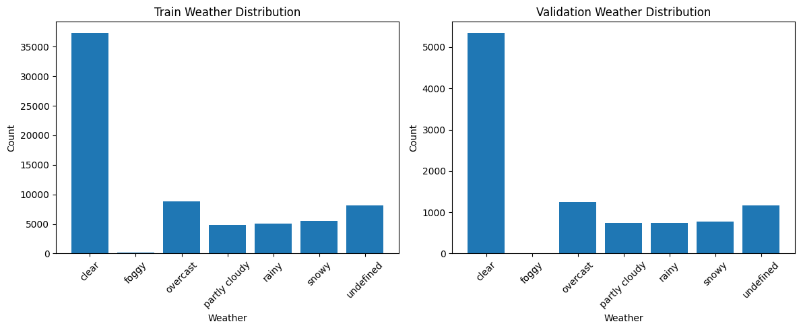

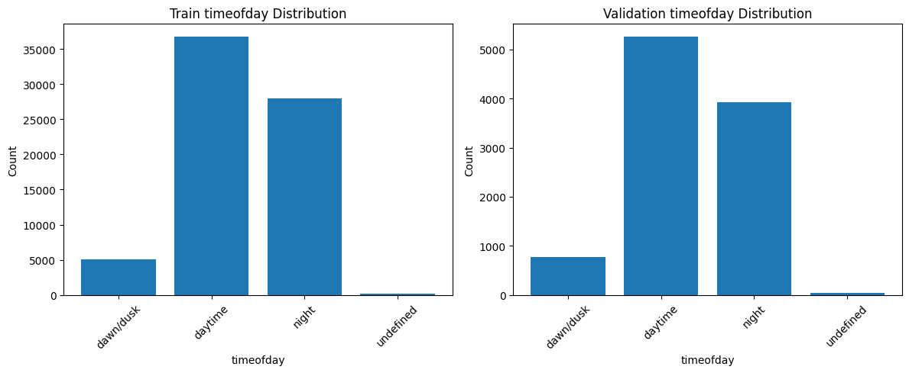
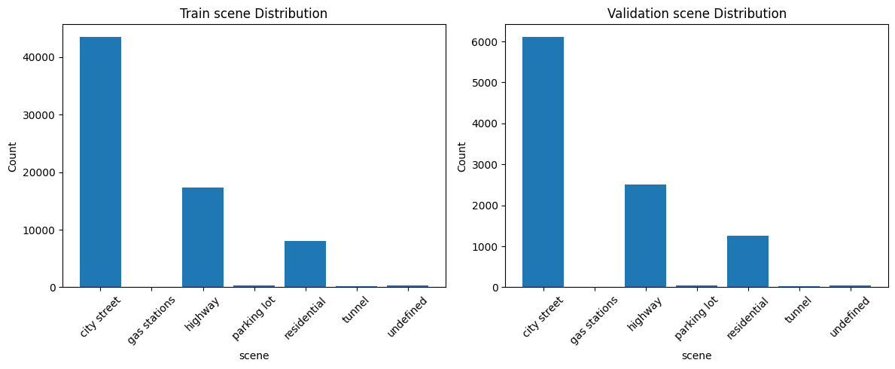

### Class Distribution

BDD100K exhibits a long-tailed class distribution. *Car* dominates with nearly half of all annotations, while *train* and *motorcycle* are severely underrepresented. This imbalance directly impacts model training — rare classes receive fewer gradient updates and are consistently missed at inference time.

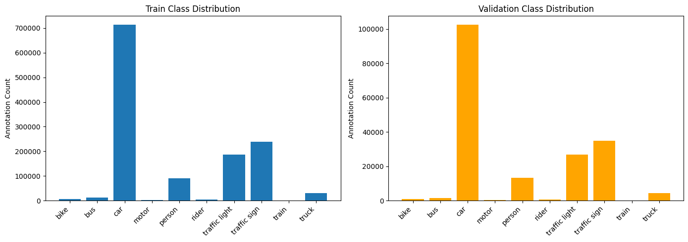

### Occlusion and Truncation

Moving object classes — *bicycle, bus, motorcycle* — show higher occlusion rates. Truncation is more uniformly distributed across classes. Both factors are known to reduce detection recall and are worth tracking separately in evaluation.

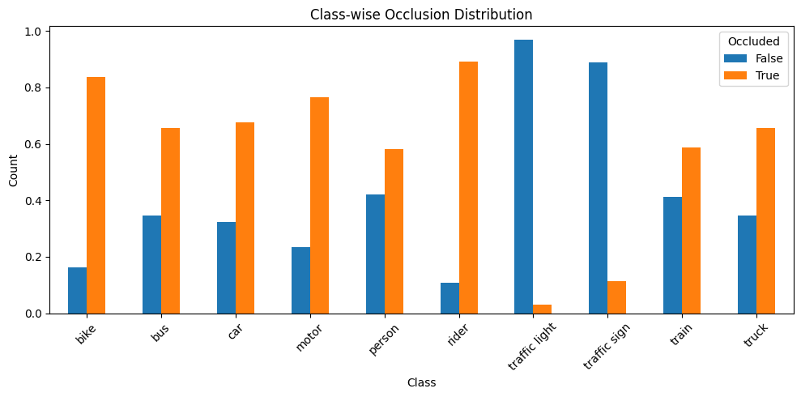
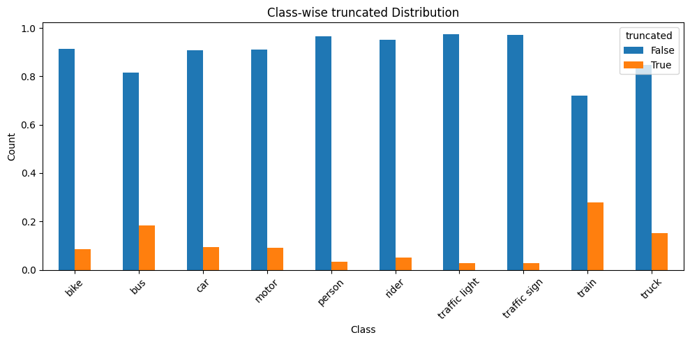

### Bounding Box Spatial Distribution

Bounding box centers show strong spatial clustering per class — *cars* concentrate near the centre-horizon, *traffic lights* in the upper-centre. This geometric bias means the model may struggle with objects appearing in atypical spatial positions.

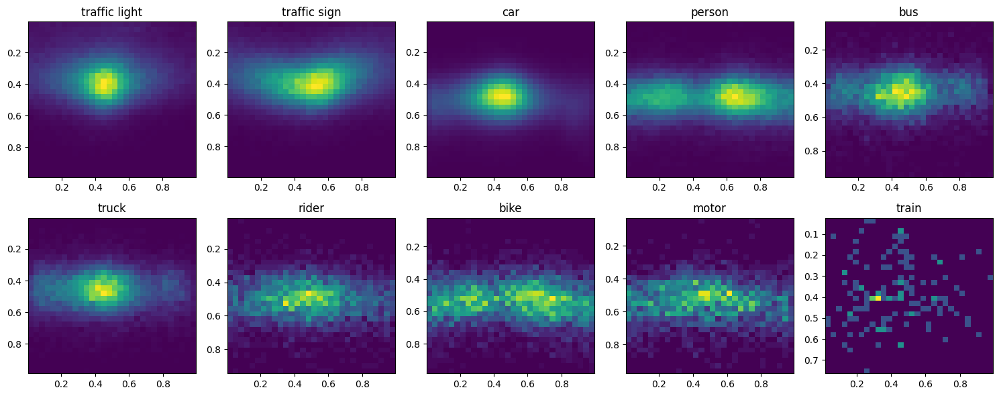

### Bounding Box Size and Annotation Quality

Exploration of bounding box sizes revealed two annotation quality concerns at the extremes of the size distribution.

**Very small boxes** are frequently incorrect — they tend to correspond to partially visible or ambiguous objects where the annotator marked a region too small to be reliably detected. Including these during training introduces noisy supervision and can hurt model performance. For example, many small bounding boxes in the *traffic sign* category are incorrect, raising questions about annotation quality that would need to be addressed before full-scale training.

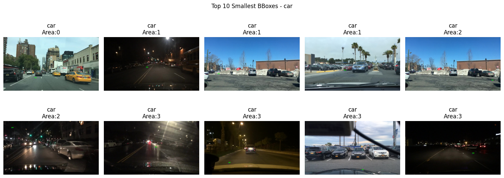

**Very large boxes** also suffer from quality issues — oversized annotations often loosely wrap around objects, include significant background, or cover multiple instances under a single box. This leads to imprecise localisation targets and contributes to mAP@0.75 degradation.

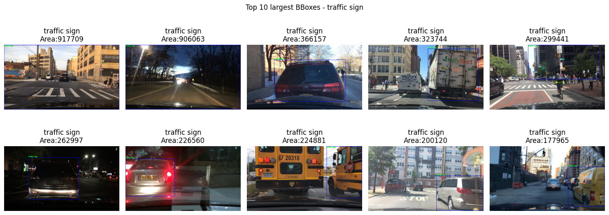

A simple area-based filtering step — dropping boxes below a minimum pixel area threshold and reviewing boxes above a maximum threshold — would be a low-effort data cleaning step with meaningful impact on localisation quality.

---
Initially I had explored a few detection models including Faster R-CNN and some other BDD-aligned options, but due to training constraints, implementation complexity and unsatisfactory results, I later shifted my focus to the YOLO series once I had more time to experiment.

Given additional time after the initial submission work, I converted the dataset into YOLO format and started experimenting with YOLO-based training as it allowed much faster iteration, easier fine-tuning and better practical performance for this task. Since the business requirement is not just to get a reasonable mAP but to understand where the model is failing and improve those cases, I also wrote an evaluation pipeline to analyse failures in more detail across classes, occlusion level, truncation, scene type and bounding box size.

One of the first observations from this analysis was that the model was struggling significantly on small bounding boxes. At the same time, from a business perspective, not all small objects are equally important. For example, very small cars, trucks or buses are usually far away and may not matter as much, whereas even small traffic lights and traffic signs are still important. Based on this, I first removed very tiny boxes using a simple threshold and later extended this idea into a classwise filtering strategy using minimum area, width and height thresholds. The filtering was made stricter for car, truck and bus, moderate for person, rider, bike and motor, and lenient for traffic light and traffic sign. This filtering was applied only on training data while keeping validation unchanged.

The idea behind this experiment was simple: if some categories contain noisy or low-value small boxes, then removing them strategically may help the model focus more on clearer and more useful training samples. However, after training with this setup, the model became more conservative. Precision improved for some important classes like car, but recall dropped across most classes, especially for person, bike, rider and other small or difficult objects. The occlusion-wise metrics also showed that performance on occluded objects dropped further, and even non-occluded recall reduced slightly. This indicates that while the classwise filtering logic was sensible, applying it aggressively removed useful hard examples from training and reduced the model’s ability to generalise.

The latest YOLO-based results are as follows:

```bash 

=== Per-class metrics ===
        class  gt_count  pred_count    tp   fp    fn  precision@0.5IoU  recall@0.5IoU  f1@0.5IoU
        train        15           0     0    0    15          0.000000       0.000000   0.000000
        motor       428         189   123   66   305          0.650794       0.287383   0.398703
         bike       979         521   317  204   662          0.608445       0.323800   0.422667
        rider       614         323   207  116   407          0.640867       0.337134   0.441836
       person     12585        7297  5352 1945  7233          0.733452       0.425268   0.538376
          bus      1584        1089   734  355   850          0.674013       0.463384   0.549196
        truck      4186        2859  1996  863  2190          0.698146       0.476828   0.566643
 traffic sign     28605       23044 15535 7509 13070          0.674145       0.543087   0.601561
          car     95109       60814 52010 8804 43099          0.855231       0.546846   0.667124
traffic light     17444       16631 10144 6487  7300          0.609945       0.581518   0.595393
```

```bash

=== Occlusion / Truncation metrics ===
       bucket  gt_count    tp    fn  recall@0.5IoU
 non_occluded     81579 53487 28092       0.655647
non_truncated    148952 76227 72725       0.511755
     occluded     79970 32931 47039       0.411792
    truncated     12597 10191  2406       0.809002
```

```bash

=== Top confusion pairs ===
     gt_class    pred_class  count
        truck           car    575
          car         truck    180
 traffic sign traffic light    135
          bus           car    114
          bus         truck    113
        truck           bus    104
traffic light  traffic sign     93
        rider        person     74
          car           bus     49
          car        person     35
       person           car     33
 traffic sign           car     29
          car  traffic sign     24
         bike        person     23
       person         rider     18
        motor           car     18
        motor          bike     18
         bike         motor     11
          car traffic light     10
       person  traffic sign      8
```

```bash
=== Size bucket summary ===
bucket    tp    fp    fn
 small 18754 11098 55617
medium 46036 13299 18014
 large 21628  1952  1500

```
From these numbers, we can see that the model is relatively better on medium and large objects, while small objects are still a major challenge. The car class has very high precision, which supports the idea that filtering removed noisy detections, but the recall is still moderate, which means the model is now missing many valid instances as well. Traffic light and traffic sign remain comparatively stable, which also shows that classwise filtering helped preserve useful small objects for those classes. At the same time, the very large false negatives for small boxes and reduced recall on occluded objects make it clear that filtering alone is not enough.

So the main takeaway from this YOLO series of experiments is that classwise preprocessing is useful, but hard filtering creates a trade-off between precision and recall. A better next step would be to combine mild filtering with data balancing, oversampling of useful visible objects, and possibly class-aware sampling instead of removing difficult samples too aggressively.


## Evaluation
 
 The following script can do the evaluation, metric calculation and also gives us glimbse of where our model failed by saving some examples of FP,FN,and confusion examples. 
 
 
 ```bash
 python evaluate_bdd_failures.py
 ```
 
 ## Baseline model evaluation. 
 
 This was first Yolo model experiment where we trained the model on whole data, with a fixed threshold filtering (if area is less than 0.02% of the image size, we remove them).

 1. We have written a script to Evaluate our model on validation data where we can see on which samples our model failed. What was kind of failure (Fp, FN, Mismatch). As we have discussed in the EDA, we had noticed the small bounding boxes having very bad quality, hence even during training we have filtered those bboxes. And even for evaluation they have not been considered. 
 2. To partially clean the data, we can take help of our trained model, the idea is to see where our model is giving false positives. That means our model is predicting a class but that bbox is not even in the ground truth. If we can definitely say our model is correct then we can add this datapoint to the ground truth. Now how we evaluate if our model is correct or not is subjective. As a simple strategy we can have a tool with human in loop that will verify model outputs. Or else if the resources are available, a foundational vlm can do the same job.
 
 For eg, in `eval_bdd_failures_val` directory we have datapoints that mismatched in the GT and preds in validation set.
 
     a.  If you open, `examples_false_positives` directory, we can see the examples where our model has predicted something but GT had no  labels in that area.  All these blue boxes were not labelled in the GT. Now we can improve our data by having a human in looop/ vlm to verify and update our val set. imp: this image only shows the bboxes which were not present in gt and our model has predicted.
 
 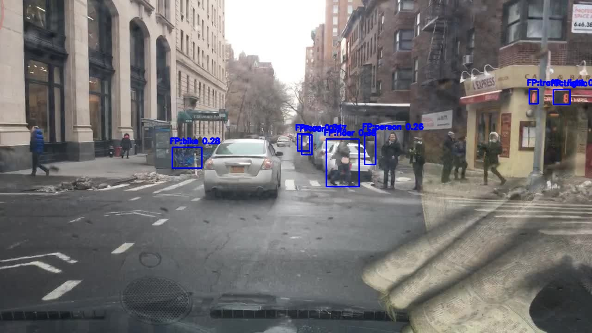
         In this example GT has missed some important samples like people, bikes and traffic signs classes in above img.
 
 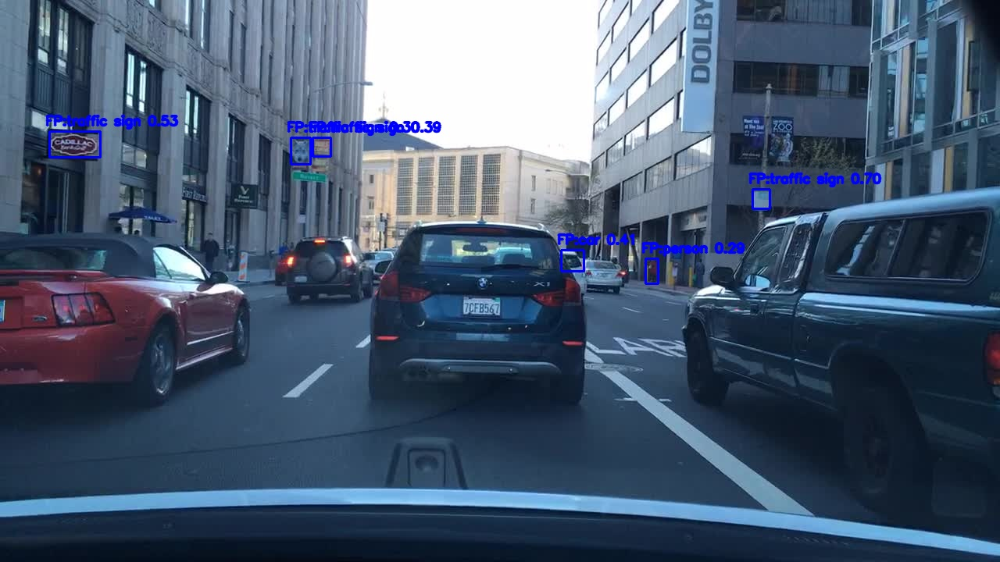
         Few bboxes that our model has predicted are correct. We can include them in GT.
 
     b.  Similary in `eaxamples_false_negatives` directory, we can see the bboxes which our model missed, ie. it did not predict anything for those bboxes. Now with a human in loop (HIL) validation or VLM, we can see the cases and if we feel the GT label is wrong, we can improve our GT data by removing those labels. below are few examples.
 
 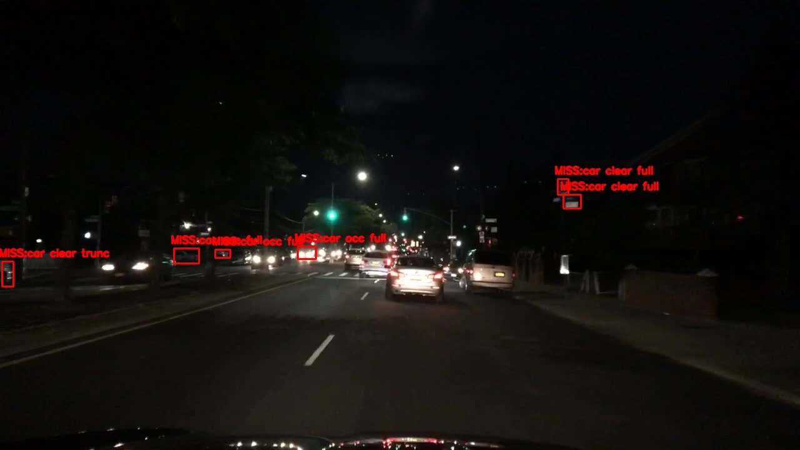
         In this example, we can see that the right top corner has car bboxes, which is wrong. We can remove these bboxes with car label.  
 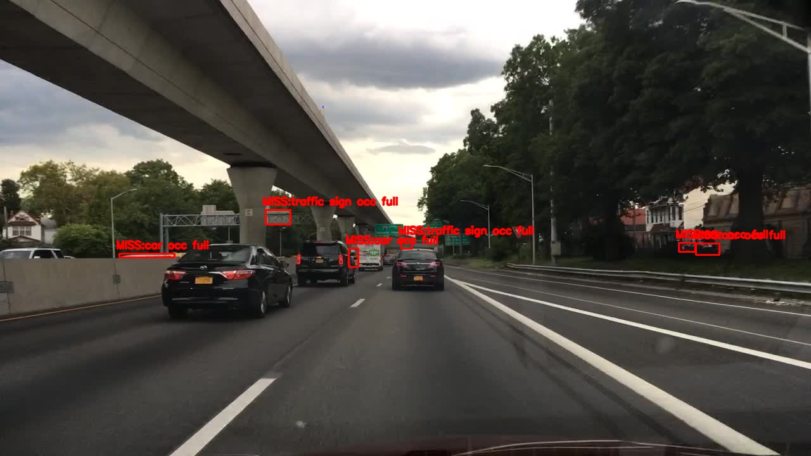
         In this example, the car at the left most has only its top visible. Such bboxes can be removed. 
 
 
     c. In `examples_confusion` directory, we have samples where bbox exists in GT and even model has predicted the bbox. But the classes are not matching. This is interesting section where we can see where our model is having confusions/difficulty with samples. Based on the validation results, stats for confusion is like following. 

```bash
         === Top confusion pairs ===
          gt_class    pred_class  count 
             truck           car    714
               car         truck    201
               bus           car    172
      traffic sign traffic light    128
               bus         truck    119
             truck           bus    108
     traffic light  traffic sign     92
             rider        person     86
               car           bus     56
            person           car     51
      traffic sign           car     49
               car        person     44
             motor           car     28
               car  traffic sign     25
            person         rider     25
              bike        person     25
             motor          bike     17
               car traffic light     11
              bike         motor     11
            person  traffic sign      8
     
     ** Aboove confusion pairs will be generated once you run the evaluation script :)
 
``` 
 
     We can understand if model is making mistakes in similar classes. If model is confused between classes {car, bus, truck}, {rider, person}, {traffic sign, traffic light} it is understandable and most likely model issue. But when model is confused between [car and person (44 instances)],  [traffic sign and car (49 instances)], [motor and car (28 instances)], [bike and person (25 instances)], we can say there could be a data labelling issue. 
 
     We have found such examples like following. 
 
 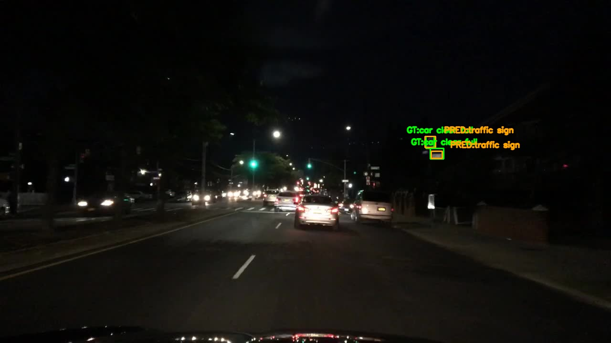
         In this, the ground truth is car but in reality it is a traffic sign or maybe nothing. 
 
 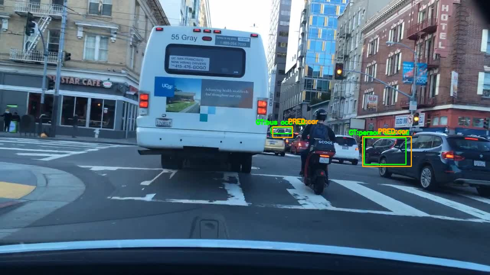    
         On the right side, we have ground truth as person, but in reality it is car and our model has predicted this correctly. 
 
     
 
 I have shown examples for validation data here. But the same can be done on the training data, and we can find such bad quality data in training dataset. 
 
 If you think about this, we are kind of following a contrastive learning approach but with a external validator in loop. In [SimClr](https://arxiv.org/abs/2002.05709), this is done to label the large unlabelled dataset, but we are extending this idea for making our data better. 
 
 Above filtering can be done iteratively to filter our GT data. And with VLM, this can be scaled for larger data size. 
 
 
 
 ### Class level metrics 
 The evaluation script has given the class level metrics as following. We can see that the performance  
 
 ```bash
 === Per-class metrics ===
         class  gt_count  pred_count    tp    fp    fn  precision @0.5IoU  recall @0.5IoU  f1 @0.5IoU
         train        15           0     0     0    15          0.000000       0.000000   0.000000
         motor       428         173   117    56   311          0.676301       0.273364   0.389351
          bike       979         547   326   221   653          0.595978       0.332993   0.427261
         rider       614         331   213   118   401          0.643505       0.346906   0.450794
           bus      1584        1098   737   361   847          0.671220       0.465278   0.549590
        person     12585        8735  5883  2852  6702          0.673497       0.467461   0.551876
         truck      4186        2916  2010   906  2176          0.689300       0.480172   0.566038
  traffic sign     28605       22745 15460  7285 13145          0.679710       0.540465   0.602142
 traffic light     17444       15261  9687  5574  7757          0.634755       0.555320   0.592386
           car     95109       88450 65391 23059 29718          0.739299       0.687537   0.712479
 
 
 
 ```
 
 We can see that our model is clearly failing to detect the train class, which is expected as this class was very less in both training and validation data. we can do oversampling of this class or if possible get more samples for this class from external dataset. 
 
  Also one thing that is important for us is that we should be able to identify non-occluded non-truncated objects with high precision and recall. 
 
 ### Occlussion and truncation wise metrics 
 
 ```bash
 === Occlusion / Truncation metrics ===
        bucket  gt_count    tp    fn  recall @0.5IoU
  non_occluded     81579 56526 25053       0.692899
 non_truncated    148952 89569 59383       0.601328
      occluded     79970 43298 36672       0.541428
     truncated     12597 10255  2342       0.814083
 
 ```
  
 As expected our current model is performing poorly for obcluded objects which is fair. Even while going through the GT labels, i found at so many places that the occluded labels are of bad quality. Whether we should feed those bad samples to model is subjective and we could also cleanup/prepocess our data for model improvement. 
 
 So assuming we have done data re-labelling task i mentioned in earlier part, (it will require writing a small tool and then manually clean or automate the process; hence im skipping it for the assignment. ). 
 
 
 ### scene wise miss
 
 === Misses by scene ===
        scene  miss_count
  city street       43313
      highway       12391
  residential        5470
  parking lot         263
    undefined         196
       tunnel          52
 gas stations          40
 
 
 
 City streets are chaotic and will have many bounding boxes, mostly would be occluded and where i think our model would be doing bad. I will recalculate these metrics after training the model the way mentioned in the `Occlussion and truncation wise metrics` section.
 
 
 ### BBox size wise report
 
 ```
 
 === Size bucket summary ===
 bucket    tp    fp    fn
  small 30367 22765 44004
 medium 47820 15683 16230
  large 21637  1984  1491
 
 ```
 
 we see our model is doing little bad for small bboxe. One can say, okay we dont care for cars that are too far awa, we need to detect the ones that are close. So  for classes like car, truck, bus if we have small bboxes, we can ignore them. For small bboxes for traffic light, traffic signal we should keep those small bboxes. For person, bike a small to medium sized bboxes should be considered. Till now we have removed only the bboxes which are smaller than a specific area threshold value but now looking at this we can have a classwise area threhsolds, width and height threshold.
 
 -------------------------------------------------------------------------------------------------------------------------------------------
 ## EXP 1: Classwise box area, height width threhsolds..
 
 
 
 After looking at the size bucket analysis earlier, we had seen that the model was struggling quite a bit on small bounding boxes. Also from a business point of view, detecting very small instances of cars, trucks or buses is not that critical compared to detecting clearly visible objects. At the same time, for classes like traffic light and traffic sign, even small bounding boxes are important. For person, rider, bike and motor it lies somewhere in between. Based on this, instead of using a single global threshold, I introduced classwise filtering using minimum area, width and height thresholds.
 
 After training with this setup, the model became more conservative. For classes like car, we can see that precision has improved significantly (~0.85), which means the model is making fewer false positives and the predictions are cleaner. However, recall has dropped (~0.54), indicating that the model is missing more objects than before. This trend is consistent across most classes. For person, bike and rider, the drop in recall is even more noticeable, which suggests that we may have removed some valid smaller instances that were useful for learning.
 
 | class         | gt_count | pred_count |    tp |   fp |    fn | precision@0.5IoU | recall@0.5IoU | f1@0.5IoU |
| ------------- | -------: | ---------: | ----: | ---: | ----: | ------------------------------------------: | ------------------------------------: | ----------------------------: |
| train         |       15 |          0 |     0 |    0 |    15 |                                      0.0000 |                                0.0000 |                        0.0000 |
| motor         |      428 |        189 |   123 |   66 |   305 |                                      0.6508 |                                0.2874 |                        0.3987 |
| bike          |      979 |        521 |   317 |  204 |   662 |                                      0.6084 |                                0.3238 |                        0.4227 |
| rider         |      614 |        323 |   207 |  116 |   407 |                                      0.6409 |                                0.3371 |                        0.4418 |
| person        |    12585 |       7297 |  5352 | 1945 |  7233 |                                      0.7335 |                                0.4253 |                        0.5384 |
| bus           |     1584 |       1089 |   734 |  355 |   850 |                                      0.6740 |                                0.4634 |                        0.5492 |
| truck         |     4186 |       2859 |  1996 |  863 |  2190 |                                      0.6981 |                                0.4768 |                        0.5666 |
| traffic sign  |    28605 |      23044 | 15535 | 7509 | 13070 |                                      0.6741 |                                0.5431 |                        0.6016 |
| car           |    95109 |      60814 | 52010 | 8804 | 43099 |                                      0.8552 |                                0.5468 |                        0.6671 |
| traffic light |    17444 |      16631 | 10144 | 6487 |  7300 |                                      0.6099 |                                0.5815 |                        0.5954 |


 Looking at the occlusion metrics, performance on occluded objects has dropped further (recall ~0.41), while non-occluded performance has also reduced slightly (~0.65). This indicates that by removing smaller and harder samples, the model has become biased towards easier, clearer objects and is not generalising well to difficult cases anymore. This is also reflected in the size bucket summary where small objects now have a very high number of false negatives.


 | bucket        | gt_count |    tp |    fn | recall@0.5IoU |
| ------------- | -------: | ----: | ----: | ------------------------------------: |
| non_occluded  |    81579 | 53487 | 28092 |                                0.6556 |
| non_truncated |   148952 | 76227 | 72725 |                                0.5118 |
| occluded      |    79970 | 32931 | 47039 |                                0.4118 |
| truncated     |    12597 | 10191 |  2406 |                                0.8090 |

 
 Confusion patterns between classes such as car-truck, traffic sign-traffic light and rider-person are still present, which tells us that this approach is mainly addressing noise due to size and not the semantic confusion between similar classes. (As discussed earlier we would have built a tool to fix this data with a HIL/VLM in loop)

        Confusion Pairs 

| gt_class      | pred_class    | count |
| ------------- | ------------- | ----: |
| truck         | car           |   575 |
| car           | truck         |   180 |
| traffic sign  | traffic light |   135 |
| bus           | car           |   114 |
| bus           | truck         |   113 |
| truck         | bus           |   104 |
| traffic light | traffic sign  |    93 |
| rider         | person        |    74 |
| car           | bus           |    49 |
| car           | person        |    35 |
| person        | car           |    33 |
| traffic sign  | car           |    29 |
| car           | traffic sign  |    24 |
| bike          | person        |    23 |
| person        | rider         |    18 |
| motor         | car           |    18 |
| motor         | bike          |    18 |
| bike          | motor         |    11 |
| car           | traffic light |    10 |
| person        | traffic sign  |     8 |

 
 
 Overall, this experiment shows that classwise size filtering is useful in reducing noise and improving precision, but it comes with a clear trade-off in recall, especially for small and occluded objects. So while the idea is directionally correct, applying it aggressively leads to loss of useful training signal. A better approach would be to combine mild filtering with data balancing or oversampling, instead of completely removing these samples.
 
 
 ** Due to lack of training resources and time, i cant try each experiment hence i think i will stop with my evaluation at this stage. I am not sure if this data is actual data from BDD or not. If it has been modified for this assignment i can understand, but if not then i guess one should release such improved data quality dataset. :)  **

 Do let me know what you guys think. Thank you.

 

Acknowledment: Took help from chatgpt to write some part of evaluation script.
